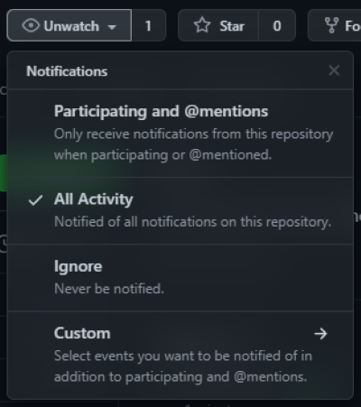
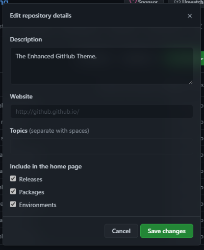
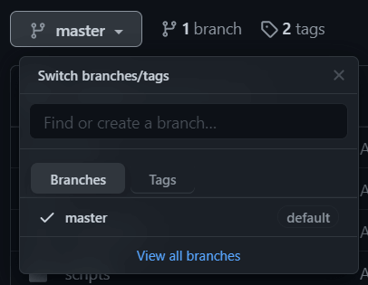
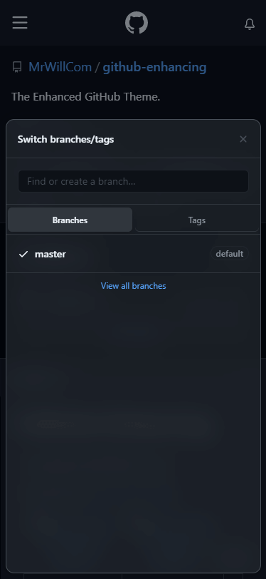

<p align="center"></p>
<h2 align="center">GitHub Enhancing</h2>
<h3 align="center"><strong>The Enhanced GitHub Theme.</strong></h3>
<p align="center"><a href="https://addons.mozilla.org/en-US/firefox/addon/github-enhancing/">Add-ons for Firefox</a> | <a href="https://microsoftedge.microsoft.com/addons/detail/ogkeblbkmfddfmdmaegnfcnpnjjijold">Microsoft Edge-Add-ons</a></p>

## Screenshots

|  |  |  |
| --- | --- | --- |
|  |  |

## Installation

The easiest way to install this extension is to install from the extension stores:
- [Add-ons for Firefox](https://addons.mozilla.org/en-US/firefox/addon/github-enhancing/)
- [Microsoft Edge-Add-ons](https://microsoftedge.microsoft.com/addons/detail/ogkeblbkmfddfmdmaegnfcnpnjjijold)

Or, you can clone this repository, [build it](#build) and add this repository as an extension to your browser.

## Contributing

Before start testing this extension, you need to install [Node.js](https://nodejs.org/) to build it manually.

### Build

Building this extension doesn't require much, just run following command with Node.js .

```sh
# Install deps
npm install
# Run build script with Node.js
node build.js
# or using `npm` scripts
npm run build
```

### Stylesheets

This extension is made up of 3 stylesheets and can be packed together by `build.js`. These 3 stylesheets manage light, dark color variables and others.

#### `styles/light.css`

This file only includes variables, and will be active in light mode.

```css
--...: ...;
...
```

#### `styles/dark.css`

Only includes variables, active in dark mode.

#### `styles/styles.css`

This file is a complete CSS file, it manages acrylic effects and layouts. If you are add something unable to add to `light/dark.css`, add it here.

```css
... {
    ...: ...;
    ...
}
...
```

### Scripts

`js/main.js` manages all JavaScript actions except rendering stylesheets. Any scripts should be here.
